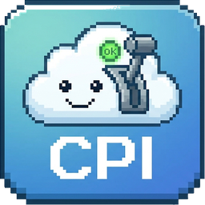
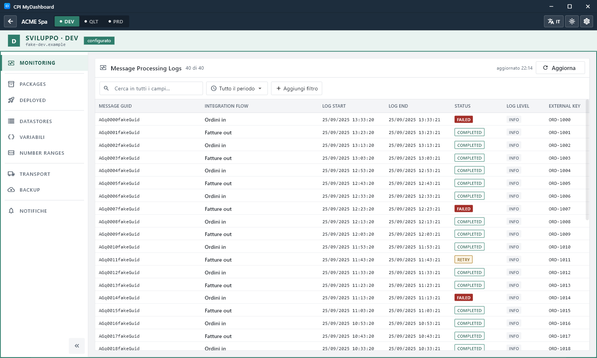

# CPI MyDashboard

**All your customers' SAP Cloud Integration tenants in one Windows app.**

### [⬇ Download the latest version](https://github.com/davideborgonovo23-stack/MyDashboard-Setup/releases/latest)

[What's new in each version (changelog)](CHANGELOG.md)

## What it is

CPI MyDashboard is a free desktop app for consultants who manage several customers on **SAP Integration Suite (Cloud Integration)**.
You enter each customer's API credentials once, for DEV, QLT and PRD. From then on you switch customer or environment with one click, with no browser, tabs or repeated logins.

## What you can do

- **Monitor** messages: filters, error details, attachments.
- Browse **packages** and **deployed** content, and download artifacts.
- **Transport** artifacts and packages DEV → QLT → PRD, with a history of who transported what and why.
- **Deploy / undeploy**, and back up a whole tenant to ZIP.
- Read **DataStores, Variables and Number Ranges**, and export them to Excel or CSV.
- Get a **Windows notification** when a message fails.

## Install

1. Download `MyDashboard-Setup-<version>.exe` from the [latest release](https://github.com/davideborgonovo23-stack/MyDashboard-Setup/releases/latest).
2. Run it. No administrator rights are needed. If Windows SmartScreen appears, choose **More info → Run anyway**: the installer is not code-signed yet.
3. On first start, choose a data folder and add your customers.

**Updates:** from version 1.2.0 the app checks this page by itself. When a new version is out it offers to update: one click downloads the installer, checks its SHA-256 fingerprint, installs it and reopens the app. Your data is always kept.

**Requirements:** Windows 10 or 11 (64-bit), HTTPS access to your tenants, and an SAP BTP service key (*Process Integration Runtime*, plan `api`) for each environment. The app includes a step-by-step guide to create it.

## Your data stays with you

- Everything is stored in a folder on your PC that you choose.
- Credentials are encrypted with AES-256 and bound to your Windows user.
- The app talks only to your SAP tenants: no cloud service in between, no telemetry.

## Terms and disclaimer

CPI MyDashboard is free to use under its [terms of use](LICENSE.txt): provided "as is", without warranty. You are responsible for being authorized to access each tenant and for complying with the agreements and policies that apply to it, including the SAP API Policy.

CPI MyDashboard is an independent tool: it is **not developed, endorsed, certified or supported by SAP**. SAP, SAP Integration Suite, SAP Business Technology Platform and other SAP products and services mentioned are trademarks or registered trademarks of SAP SE in Germany and other countries.

---

Made by Davide Borgonovo · vibe-coded with <a href="https://claude.com/claude-code">Claude Code</a> · each release lists its changes and the installer's SHA-256.
